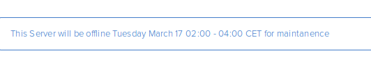
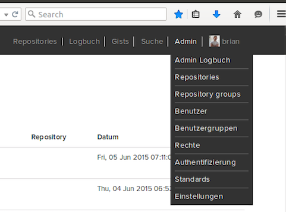

.. _admin-tricks:

One-time Admin Tasks
--------------------

* :ref:`web-analytics`
* :ref:`admin-tricks-license`
* :ref:`announcements`
* :ref:`md-rst`
* :ref:`repo-stats`
* :ref:`server-side-merge`
* :ref:`remap-rescan`
* :ref:`custom-hooks`
* :ref:`clear-repo-cache`
* :ref:`set-repo-pub`
* :ref:`ping`

.. _web-analytics:

Adding Web Analytics
^^^^^^^^^^^^^^^^^^^^

If you wish to add a Google Analytics, or any other kind of tracker to your
|RCE| instance you can add the necessary codes to the header or footer
section of each instance using the following steps:

1. From the |RCE| interface, select
   :menuselection:`Admin --> Settings --> Global`
2. To add a tracking code to you instance, enter it in the header or footer
   section and select **Save**

Use the example templates in the drop-down menu to set up your configuration.

.. _admin-tricks-license:

Licence Key Management
^^^^^^^^^^^^^^^^^^^^^^

To manage your license key, go to
:menuselection:`Admin --> Settings --> License`.
On this page you can see the license key details. If you need a new license,
or have questions about your current one, contact support@rhodecode.com

.. _announcements:

Server-wide Announcements
^^^^^^^^^^^^^^^^^^^^^^^^^

If you need to make a server-wide announcement to all users,
you can add a message to be displayed using the following steps:

1. From the |RCE| interface, select
   :menuselection:`Admin --> Settings --> Global`
2. To add a message that will be displayed to all users,
   select :guilabel:`Server Announcement` from the drop-down menu and
   change the ``var message = "TYPE YOUR MESSAGE HERE";`` example line.
3. Select :guilabel:`Save`, and you will see the message once your page
   refreshes.

.. _md-rst:

Markdown or RST Rendering
^^^^^^^^^^^^^^^^^^^^^^^^^

|RCE| can use `Markdown`_ or `reStructured Text`_ in commit message,
code review messages, and inline comments. To set the default to either,
select your preference from the drop-down menu on the
:menuselection:`Admin --> Settings --> Visual` page and select
:guilabel:`Save settings`.

.. _repo-stats:

Enabling Repository Statistics
^^^^^^^^^^^^^^^^^^^^^^^^^^^^^^

To enable |repo| statistics, use the following steps:

1. From the |RCE| interface, open
   :menuselection:`Admin --> Repositories` and select
   :guilabel:`Edit` beside the |repo| for which you wish to enable statistics.
2. Check the :guilabel:`Enable statistics` box, and select :guilabel:`Save`

.. _server-side-merge:

Enabling Server-side Merging
^^^^^^^^^^^^^^^^^^^^^^^^^^^^

To enable server-side merging, use the following steps:

1. From the |RCE| interface, open :menuselection:`Admin --> Settings --> VCS`
2. Check the :guilabel:`Server-side merge` box, and select
   :guilabel:`Save Settings`

If you encounter slow performance with server-side merging enabled, check the
speed at which your server is performing actions. When server-side merging is
enabled, the following actions occurs on the server.

* A |pr| is created in the database.
* A shadow |repo| is created as a working environment for the |pr|.
* On display, |RCE| checks if the |pr| can be merged.

To check how fast the shadow |repo| creation is occurring on your server, use
the following steps:

1. Log into your server and create a directory in your |repos| folder.
2. Clone a |repo| that is showing slow performance and time the action.

.. code-block:: bash

   # One option is to use the time command
   $ time hg clone SOURCE_REPO TARGET

.. _remap-rescan:

Remap and Rescan Repositories
^^^^^^^^^^^^^^^^^^^^^^^^^^^^^

You may want to Remap and rescan the |repos| that |RCE| is managing to ensure
the system is always up-to-date. This is useful after importing, deleting,
or carrying out general cleaning up operations. To do this use the
following steps:

1. From the |RCE|, open
   :menuselection:`Admin --> Settings --> Remap and rescan`
2. Click :guilabel:`Rescan Repositories`

Check the additional options if needed:

* :guilabel:`Destroy old data`: Useful for purging deleted repository
  information from the database.
* :guilabel:`Invalidate cache for all repositories`: Use this to completely
  remap all |repos|. Useful when importing or migrating |repos| to ensure all
  new information is picked up.

.. _custom-hooks:

Adding Custom Hooks
^^^^^^^^^^^^^^^^^^^

To add custom hooks to your instance, use the following steps:

1. Open :menuselection:`Admin --> Settings --> Hooks`
2. Add your custom hook details, you can use a file path to specify custom
   hook scripts, for example: ``python:/path/to/custom_hook.py``
3. Select :guilabel:`Save`

Also, see the |RC| Extensions section of the :ref:`rc-tools` guide. |RC|
Extensions can be used to add additional hooks to your instance and comes
with a number of pre-built plugins if you chose to install them.

.. _clear-repo-cache:

Clearing |repo| cache
^^^^^^^^^^^^^^^^^^^^^

If you need to clear the cache for a particular |repo|, use the following steps:

1. Open :menuselection:`Admin --> Repositories` and select :guilabel:`Edit`
   beside the |repo| whose cache you wish to clear.
2. On the |repo| settings page, go to the :guilabel:`Caches` tab and select
   :guilabel:`Invalidate repository cache`.

.. _set-lang:

Changing Default Language
^^^^^^^^^^^^^^^^^^^^^^^^^

To change the default language of a |RCE| instance, change the language code
in the :file:`/home/{user}/.rccontrol/{instance-id}/rhodecode.ini` file. To
do this, use the following steps.

1. Open the :file:`rhodecode.ini` file and set the required language code.

.. code-block:: ini

   ## Optional Languages
   ## en(default), de, fr, it, ja, pl, pt, ru, zh
   lang = de

2. Restart the |RCE| instance and check that the language has been updated.

.. code-block:: bash

   $ rccontrol restart enterprise-2
   Instance "enterprise-2" successfully stopped.
   Instance "enterprise-2" successfully started.

.. _set-repo-pub:

Setting Repositories to Publish
^^^^^^^^^^^^^^^^^^^^^^^^^^^^^^^

To automatically promote your local |repos| to public after pushing to |RCE|,
enable the :guilabel:`Set repositories as publishing` option on the
:menuselection:`Admin --> Settings --> VCS` page.

.. note::

   This option is enabled by default on most |RCE| versions, but if upgrading
   from a 1.7.x version it could be disabled on upgrade due to inheriting
   older default settings.

.. _ping:

Pinging the |RCE| Server
^^^^^^^^^^^^^^^^^^^^^^^^

You can check the IP Address of your |RCE| instance using the
following URL: ``{instance-URL}/_admin/ping``.

.. code-block:: bash

   $ curl https://your.rhodecode.url/_admin/ping
   pong[rce-7880] => 203.0.113.23

.. _Markdown: http://daringfireball.net/projects/markdown/
.. _reStructured Text: http://docutils.sourceforge.net/docs/index.html
