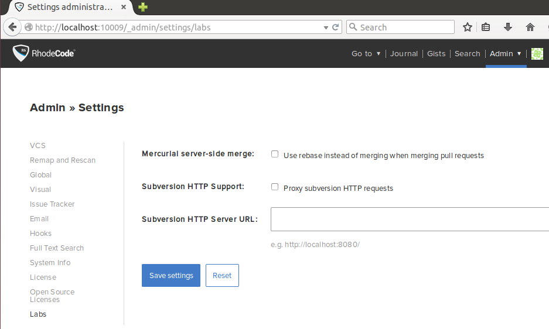

.. _lab-settings:

Lab Settings
============

|RCE| Lab Settings is for delivering features which may require an additional
level of support to optimize for production scenarios. To enable lab settings,
use the following instructions:

1. Open the |RCE| configuration file,
   :file:`/home/{user}/.rccontrol/{instance-id}/rhodecode.ini`

2. Add the following configuration option in the ``[app:main]`` section.

.. code-block:: bash

   [app:main]

   ## Display extended labs settings
   labs_settings_active = true

3. Restart your |RCE| instance

.. code-block:: bash

   $ rccontrol restart enterprise-1

4. You will see the labs setting on the
   :menuselection:`Admin --> Settings --> labs` page.

Available Lab Extras
--------------------

Once lab settings are enabled, the following features are available.

.. toctree::
   :maxdepth: 1

   svn-http
