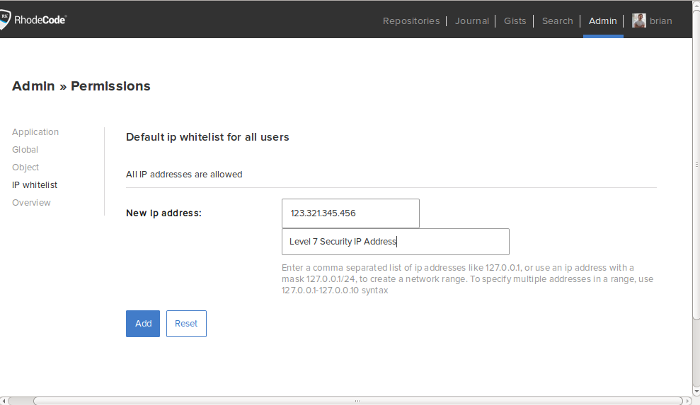

.. _settip-ip-white:

Setting IP Restrictions
=======================

To restrict access to your |RCE| instance you can set an IP Whitelist that
will only allow access from specific IP Addresses. This is useful for
ensuring only users on the company VPN can access the instance.

To set this, go to
:menuselection:`Username --> Permissions --> IP Whitelist`, and add the safe
range of IP Addresses to the list.

.. important::

   Add the IP Address that you are currently using first,
   otherwise you'll lock yourself out of the instance.

