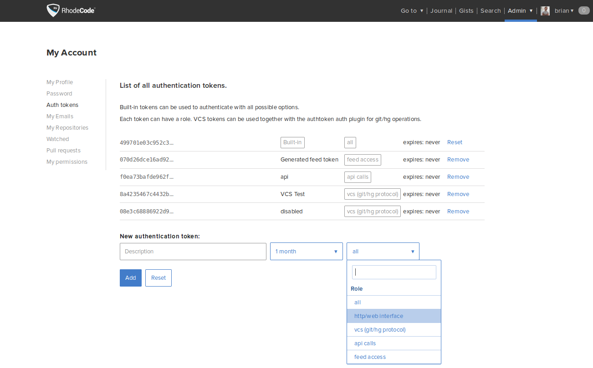

.. _config-token-ref:

Authentication Tokens
---------------------

|RCE| has 4 different kinds of authentication tokens.

* *API tokens*: API tokens can only be used to execute |RCE| API operations.
  You can store your API token and assign it to each instance in
  the :file:`/home/{user}/.rhoderc` file. See the
  example in :ref:`indexing-ref` section for more details.

* *Feed tokens*: The feed token can only be used to access the RSS feed.
   Usually those are safe to store inside your RSS feed reader.

* *VCS tokens*: You can use these to authenticate with |git|, |hg| and |svn|
  operations instead of a password. They are designed to be used with
  CI Servers or other third party tools that require |repo| access.
  They are also a good replacement for SSH based access.
  To use these tokens you need be enabled special authentication method on
  |RCE|, as they are disabled by default.
  See :ref:`enable-vcs-tokens`.

* *Web Interface tokens*: These token allows users to access the web
  interface of |RCE| without logging in.

  You can add these tokens to an |RCE| server url, to expose the page content
  based on the given token.

  This is useful to integrate 3rd party systems, good example is to expose
  raw diffs to another code-review system without having to worry about
  authentication.

  These tokens only work if a certain view is whitelisted
  under `api_access_controllers_whitelist` inside
  the :file:`rhodecode.ini` file.

.. code-block:: bash

   # To download a repo without logging into Web UI
   https://rhodecode.com/repo/archive/tip.zip?auth_token=<web-api-token>

   # To show commit diff without logging into Web UI
   https://rhodecode.com/repo/changeset-diff/<sha>?auth_token=<web-api-token>

.. _enable-vcs-tokens:

Enabling VCS Tokens
^^^^^^^^^^^^^^^^^^^

To enable VCS Tokens, use the following steps:

1. Go to :menuselection:`Admin --> Authentication`.
2. Enable the ``rhodecode.lib.auth_modules.auth_token`` plugin.
3. Click :guilabel:`Save`.

Authentication Token Tips
^^^^^^^^^^^^^^^^^^^^^^^^^

* Use Authentication Tokens instead of your password with external services.
* Create multiple Authentication Tokens on your account to enable
  access to your |repos| with a different |authtoken| per method used.
* Set an expiry limit on certain tokens if you think it would be a good idea.

Creating Tokens
^^^^^^^^^^^^^^^

To create authentication tokens for an user, use the following steps:

1. From the |RCM| interface go to
   :menuselection:`Username --> My Account --> Auth tokens`.

2. Label and Add the tokens you wish to use with |RCE|.

