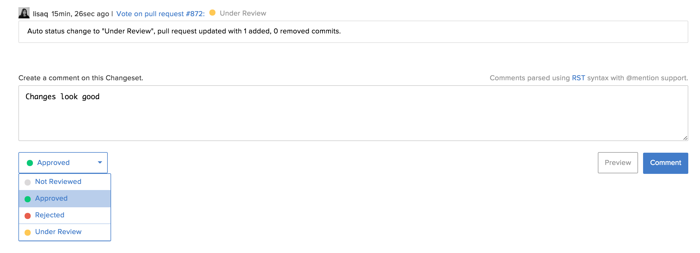

.. _code-approve-changes-ref:

Approve Code Changes
--------------------

To approve commits, use the following steps:

1. Open the commit for review
2. Leave your comments inline or in the message box.
3. Set the review status from the drop-down menu and select :guilabel:`Comment`

