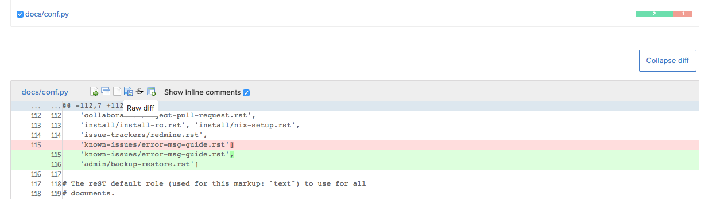
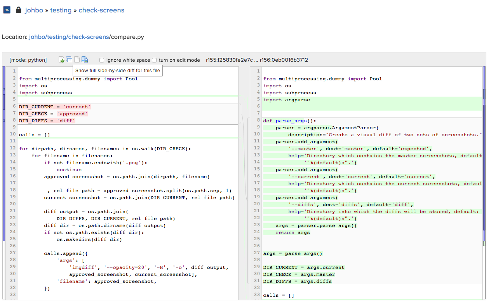

.. _code-diff-side-ref:

Reviewing Diffs
---------------

Diffs are representations of changes made between different changesets of
a file. |RCE| provides 4 different types of diffs for each commit or
changeset, and depending on your preference you can use whichever for code
review purposes.

* Plain diff
* Full diff
* Side-by-side diff
* Raw diff

Reviewing Changes
-----------------

|RCM| displays all code changes made with each commit. Removed content is
marked in red and new content in green.

Side-By-Side Diffs
------------------

To review code with a side-by-side diff, use the following steps:

1. Open the repository in which you wish to review a file
2. Select the revision you wish to review
3. Select the side-by-side diff icon beside the file name

Notifying Users
---------------

To notify other users of you comments, or requests for feedback,
see :ref:`review-notifications-ref`
