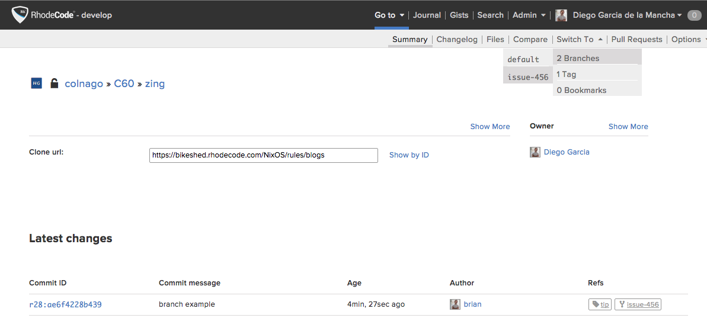

.. _forks-branches-ref:

Forking and Branching
---------------------

Forking clones the original |repo| and creates an independent |repo|.
Branching allows you to develop independently
of the main branch based on the changeset branched, but remains linked to the
main |repo|.

Both provide excellent collaboration functionality,
and do not differ greatly, but you can find many online discussions
where people fight about the differences.

Fork a |repo|
^^^^^^^^^^^^^

To fork a |repo|, use the following steps:

1. Select :menuselection:`Admin --> repositories`
2. Select the |repo| you wish to fork.
3. Select :menuselection:`Options --> Fork`
4. On the :guilabel:`Create fork` page, set the following properties:

   * The fork name
   * The fork description
   * If the fork is private or public
   * The copy permissions

Branch a |git| |repo|
^^^^^^^^^^^^^^^^^^^^^

Currently branching is only supported from the command line but is picked up
on the web interface. To branch a |git| |repo| use the following example:

.. code-block:: bash

    # branch and checkout
    git branch new-branch
    git checkout new-branch

    # same function shorthand
    git checkout -b new-branch

    # Example usage
    $ git checkout -b example-branch
    Switched to a new branch 'example-branch'

    $ git status
    On branch example-branch
    Initial commit
    nothing to commit (create/copy files and use "git add" to track)
    $ vi example-script.sh
    $ git add example-script.sh
    $ git commit -a -m "ghost script: initial file"
    $ git push

Once it is pushed to the |RCM| server, you can switch to the newly created
branch using the following steps:

1. Select :menuselection:`Admin --> Repositories`.
2. Select the |repo| you branched.
3. Select :menuselection:`Switch To --> Branches` and choose the new branch.

For more information, your can read more here on the Git website,
`Git Branching`_.

Branch a |hg| |repo|
^^^^^^^^^^^^^^^^^^^^

.. note::

    To use branches in |hg| like |git|, use the `hg bookmark` option instead.
    Also see the :ref:`bvb` section for more information.

To branch a |hg| |repo|, use the following example and push your changes to
the main |repo|. Once pushed, you can view the new branch in |RCE| by
selecting :menuselection:`Switch To --> Branches` from the |repo| page.

.. code-block:: bash

    $ hg branch example-456
    $ hg ci -m "branch: ticket #456"
    $ hg push --new-branch

Bookmark a |hg| |repo|
^^^^^^^^^^^^^^^^^^^^^^

Bookmarks are used in |hg| in much the same way as branches are in |git|. See
the `Mercurial Bookmarks`_ documentation for more information.

.. code-block:: bash

    $ hg bookmark example-456
    $ hg ci -m "branch: ticket #456"
    $ hg push -B example-456

.. _Git Branching: http://git-scm.com/book/en/v2/Git-Branching-Basic-Branching-and-Merging
.. _Mercurial Bookmarks: https://mercurial.selenic.com/wiki/Bookmarks
