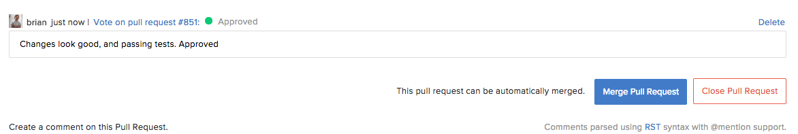

.. _merge-requests-ref:

Merge a |pr|
------------

|RCM| can detect if it can automatically merge the changes in a |pr|. If it
can, you will see the following message:
:guilabel:`This pull request can be automatically merged.` To merge,
click the big blue button! To enable this feature, see :ref:`server-side-merge`.

If you cannot automatically merge a |pr|, you will see one of the following
messages:

* :guilabel:`This pull request cannot be merged because of conflicts`
* :guilabel:`Reviewer approval is pending`

.. _manual-merge-requests-ref:

Manual Merge a |PR|
^^^^^^^^^^^^^^^^^^^

If |RCM| cannot safely merge the changes in a |pr|,
usually due to conflicts, you need to manually merge the changes on the
command line. You can see more information for each |repo| type at the
following links:

* `Git Manual Merging`_
* `Mercurial Manual Merging`_
* `Subversion Manual Merging`_

.. _Git Manual Merging: http://git-scm.com/book/en/v2/Git-Branching-Basic-Branching-and-Merging
.. _Mercurial Manual Merging: http://hgbook.red-bean.com/read/a-tour-of-mercurial-merging-work.html
.. _Subversion Manual Merging: http://svnbook.red-bean.com/en/1.7/svn.branchmerge.basicmerging.html
