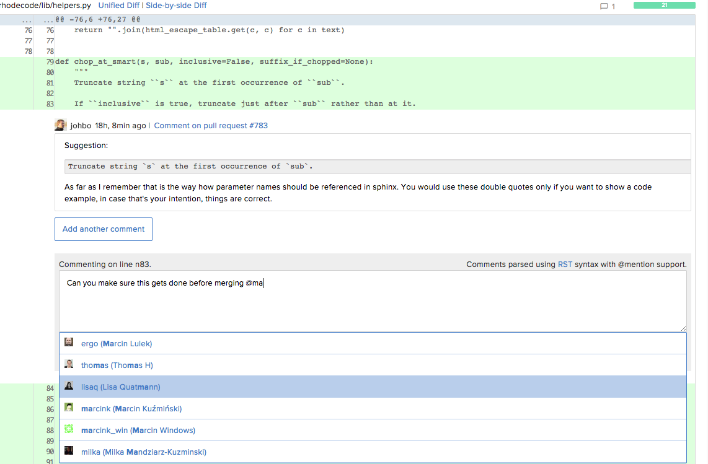

Notifications Overview
----------------------

|RCM| has an integrated notification system which alerts users to requests
that they have received. Notifications can occur for the following reasons:

* Pull request reviews
* Commit message mentions

When someone opens a |pr| on one of your |repos|, or adds you as a |pr|
reviewer, you will receive a notification in |RCE| and an email,
if not configured see :ref:`set-up-mail`. Also, during the review process you
receive notifications on the following actions:

* New comments
* Status changes
* Inline code review comments

Each notifications provides a link to take you directly to the issue.

