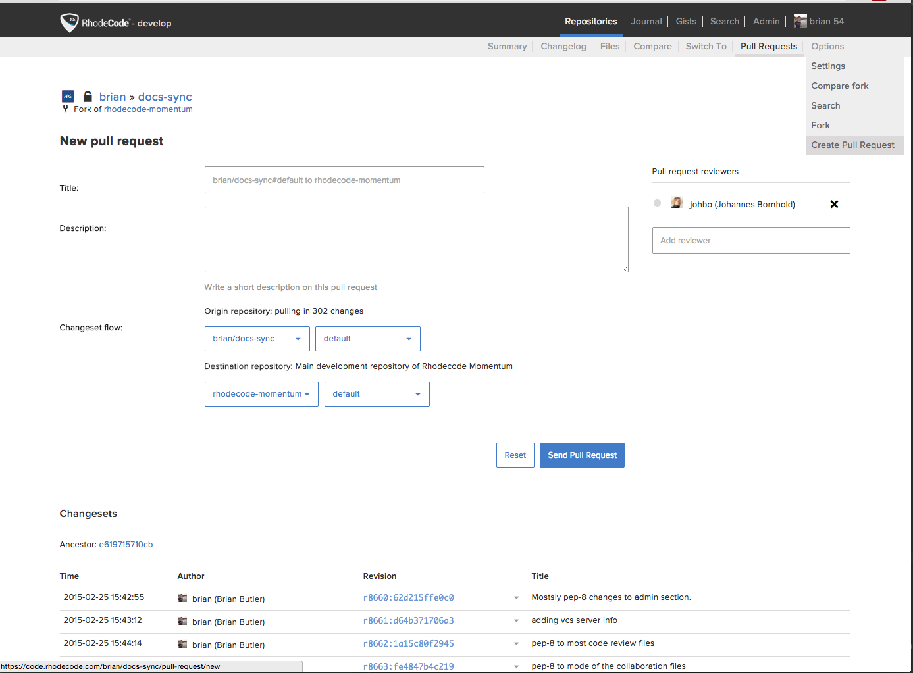

.. _open-requests-ref:

Open a |pr|
-----------

.. important::

   To open a |pr|, it is necessary that the source and the target repositories
   have at least one commit in common. For more information,
   see :ref:`merging-empty-repo-ref`.

Once you have finished your work on a fork and want your work merged with the
original |repo|, you need to open a |pr|. To open a |pr| and send for
review, use the following steps:

1. Select
   :menuselection:`Admin --> repositories --> repo name --> Options --> Create Pull Request`
2. On the :guilabel:`New Pull Request` page, enter the following information:

   * The |pr| name.
   * The |pr| description.
   * Add the reviewer names in the :guilabel:`Pull Request Reviewer` field.

3. Review the changesets that make up the |pr|.
4. Select :guilabel:`Submit Pull Request`.

The pull request can either be merged into the original repository,
or it can be declined due to issues during the review process. If issues
arise, you can fix them and update the |pr|. For more,
see :ref:`update-requests-ref`.
