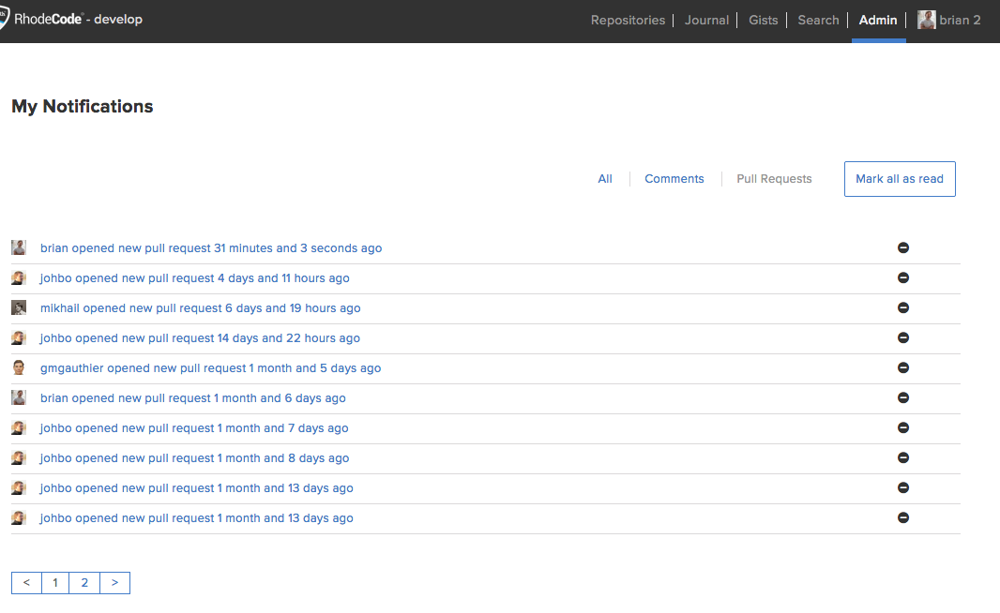
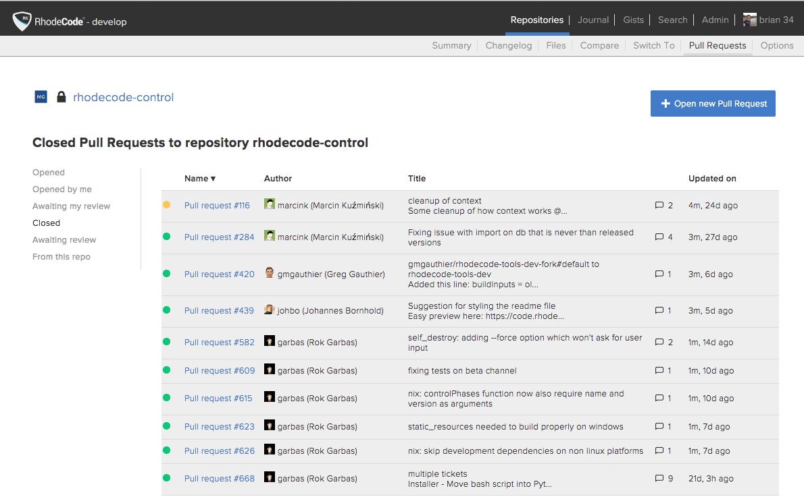

Pull request management
-----------------------

.. only:: html

    There are two ways of tracking |prs| within |RCM|.

    1. :ref:`prs-your-review`
    2. :ref:`prs-per-repo`

.. _prs-your-review:

Pull requests for your review
^^^^^^^^^^^^^^^^^^^^^^^^^^^^^

To view pull requests for your review, use the following steps:

1. From the |RCM| interface, Select
   :menuselection:`username --> Notifications`
2. Select :guilabel:`Pull Requests`

.. _prs-per-repo:

Pull requests per |repo|
^^^^^^^^^^^^^^^^^^^^^^^^

To view pull requests going to and from a |repo|, use the following steps:

1. Select the |repo| you wish to view
2. Select :guilabel:`Pull Requests` from the top menu
3. On the left-hand pane you will see the following options for |pr|
   management on that |repo|:

   * :guilabel:`Opened`: Pull requests opened on this |repo|.
   * :guilabel:`Opened by me`: Pull requests you opened on this |repo|.
   * :guilabel:`Awaiting my review`: Pull requests awaiting your review.
   * :guilabel:`Closed`: Closed |prs| on this |repo|.
   * :guilabel:`Awaiting review`: Pull requests still awaiting review on
     this |repo|.
   * :guilabel:`From this repo`: Pull requests opened on another |repo| with
     the changes coming from this |repo|.

