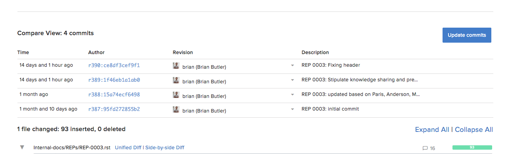

.. _update-requests-ref:

Update a |pr|
-------------

.. important::

   Updating a |pr| invalidates all previous reviews, and the status set by
   each reviewer. This means all reviewers need to review and approve the
   |pr| again.

If you have made changes on the fork or branch from where a |pr| originates,
you can update the |pr|, using the following steps:

1. Commit and push your changes to the |RCE| server.
2. Open the |pr| you wish to update, and select the :guilabel:`Update commits`
   button.

Once updated the following commit message will be automatically added to the
|pr|.

:guilabel:`Auto status change to "Under Review", pull request updated with 1 added, 0 removed commits.`

3. Review the new commit messages and changes as before,
4. Set the review status and click :guilabel:`Comment`

Inline Comments
^^^^^^^^^^^^^^^

When updating a |pr|, inline comments can move around depending on which line
they are attached:

* If the line content changes but remains in place, the inline comment will
  remain where it was originally.
* If the line to which the inline comment is attached moves, the comment will
  move with it.
* If the diff changes substantially and the line to which the comment was
  attached is no longer in the diff, the inline comment will be hidden but
  with an icon to display it if necessary.

