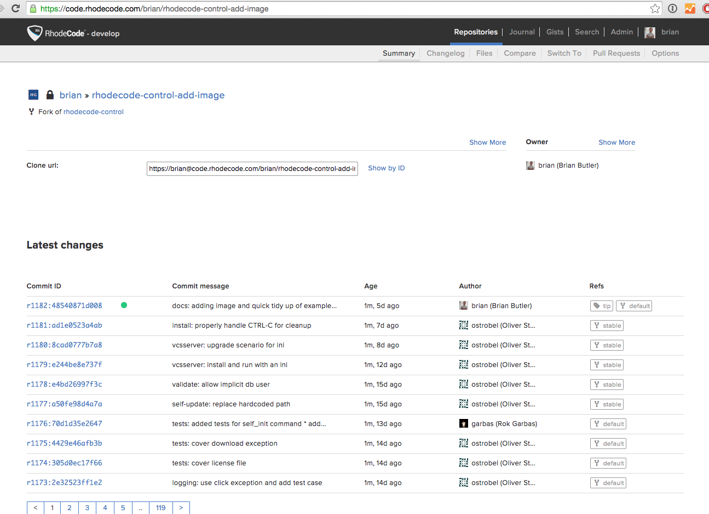
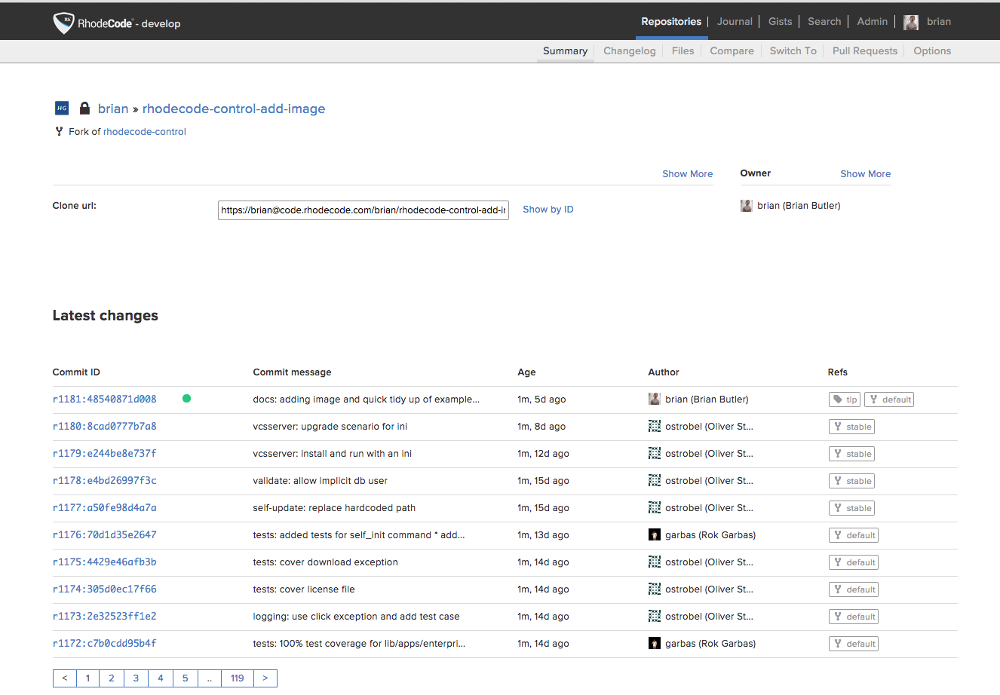

.. _api-ex:

API Example Usage
=================

Use the following example uses of the |RCE| API to carry out work on your
instances, or |repo| maintanence on the server. For the complete API
documentation, see the :ref:`api` section.

.. _api-strip:

Stripping Commits
-----------------

The strip command is useful for removing commits on the server, allowing
you to push changes without using force. To strip commits on the server, use
the following steps:

1. Install |RCT|, as explained in the :ref:`install-tools` section.
2. Configure the :file:`~/.rhoderc` file with the API connection details, as
   explained in the :ref:`config-rhoderc` section.
3. Check the |RCE| changelog and see from which revision onwards you wish to
   strip commits. This will also strip all descendants.

4. Enter your |RCT| virtual environment, using the following example:

.. code-block:: bash

    $ . venv/bin/activate
    (venv)$

5. Use the API to strip a commit, or number of commits from a |repo|. In this
   example I am stripping the top two commits from ``ad1e0523a4ab`` onwards.

.. note::

   Repositories in |repo| groups require the |repo| group to be passed as
   part of the ``repoid``.

.. code-block:: bash

    # Run the Strip API call
    $ rhodecode-api --instance-name=instance-id strip \
        repoid:repo-group/repo-name revision:ad1e0523a4ab branch:stable

    # Check the JSON-RPC verification

.. code-block:: jsonld

    {
      "error": null,
      "id": 5960,
      "result": {
        "msg": "Stripped commit ad1e0523a4ab from
            repo `repo-group/repo-name`",
        "repository": "repo-group/repo-name"
      }
    }

6. Once the commits are stripped, you can verify that they are
   stripped on the web interface.

