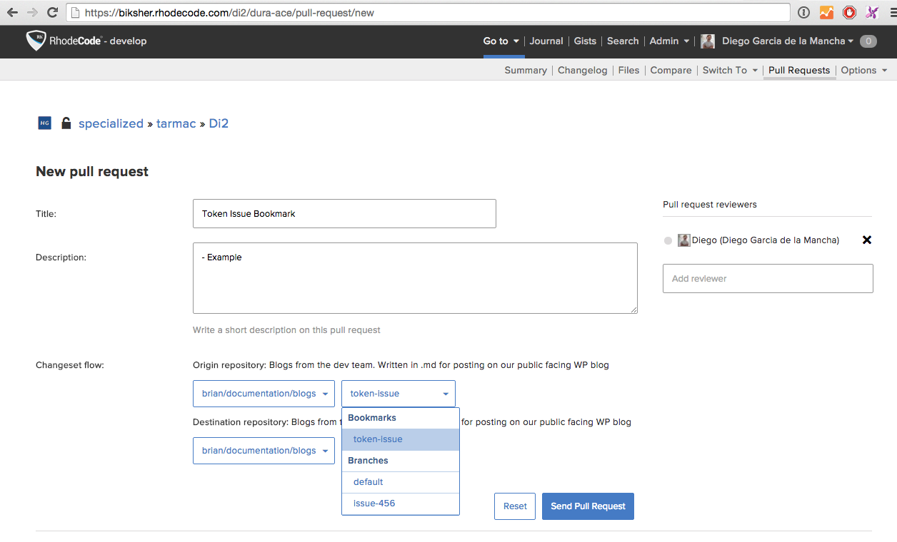

.. _bvb:

|hg| Branching Vs Bookmarking
=============================

If you wish to use the branching workflow in |hg|, as mentioned in the
:ref:`workflow` section, then there is a subtle but important difference to
note between what branching means in |git| and |hg|.

* |hg| stores branch information as a permanent part of each commit. Each
  branch needs to be named and is assigned persistent symbolic links inside the
  |repo|.
* In |git|, by contrast, a branch is simply a lightweight movable pointer to
  a commit.

This is where bookmarks replicate the |git| branch functionality in |hg|. A
bookmark is a references to a commit that can be automatically updated when
new commits are made. For more information, see the `Mercurial Bookmark`_
documentation.

To use |hg| bookmarks like |git| branches, see the following example.

.. code-block:: bash

  # Make a bookmark particular revision
  $ hg bookmark -r 3400 my-bookmark

  # push the bookmark to the server
  $ hg push -B my-bookmark

  # Delete remote bookmark, by deleting locally, then push deletion
  $ hg bookmark -d my-bookmark
  $ hg push -B my-bookmark

To open a |pr| from a bookmark using |RCE|, use the usual |pr| steps.

.. _Mercurial Bookmark: https://mercurial.selenic.com/wiki/Bookmarks

