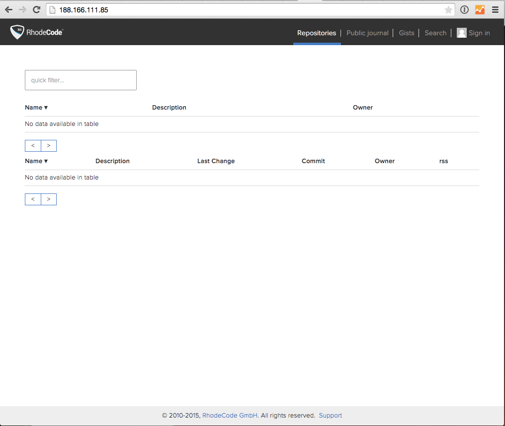

.. _hosted-solution:

Deploy |RCE| From a Hosted Server
=================================

If you wish to deploy your own |RCE| instance from something like a
`Digital Ocean`_ droplet, or a `hetzner`_ server use the following
instructions to get it setup.

I'm using an Ubuntu 14.04 image for the purposes of this
tutorial, but all other Unix environments will be pretty similar. You can
check out the full lists of supported platforms and versions in the
:ref:`system-overview-ref` section.

Create a Digital Ocean Droplet
------------------------------

1. Sign into Digital Ocean.
2. Create a Droplet choosing Ubuntu 14.04 as your |os|.
3. (Optional) Add SSH keys if you have them set up.

Configure Your Server
---------------------

Once you have your server created, you need to sign into it and set it up to
host |RCE|.

1. Open a terminal and sign into your server. Digital Ocean will mail you the
   IP address. You'll need to change your password on the first login if you
   don not have SSH keys set up.

.. code-block:: bash

    $ ssh root@203.0.113.113

2. It is not advised to install |RCE| as the ``root`` user. So create a user
   with sudo permissions and then carry out the rest of the steps from that user
   account.

.. code-block:: bash

    # Create a user with sudo permissions
    root@rhodecode:~# sudo useradd -m -s /bin/bash -d /home/brian -U brian
    root@rhodecode:~# sudo usermod -a -G sudo brian

    # Set the password for that user
    root@rhodecode:~# passwd brian
    Enter new UNIX password:
    Retype new UNIX password:
    passwd: password updated successfully

    # Switch to that user for the rest of the steps
    root@rhodecode:~# su brian

    # You should see your home dir change to what was set during installation
    brian@rhodecode:~$ cd ~
    brian@rhodecode:~$ pwd
    /home/brian

Once you have this set up, you are ready to install |RCC|.

Install |RCC|
-------------

|RCC| will install and manage the package dependencies for your |RCE| instance.

1. Download the |RCC| installer from https://rhodecode.com/download/
2. Once downloaded to your computer, transfer the package to your server

.. note::

   These steps happen on your computer, not on the server.

.. code-block:: bash

    # Change to where the file is downloaded
    $ cd Downloads/

    # SFTP to your server
    $ sftp brian@203.0.113.113

    # Use mput to transfer the file
    sftp> mput RhodeCode-installer-linux-391_b1a804c4d69b_d6c087d520e3
    Uploading RhodeCode-installer-linux-391_b1a804c4d69b_d6c087d520e3 to /home/brian/RhodeCode-installer-linux-391_b1a804c4d69b_d6c087d520e3
    RhodeCode-installer-linux-391_b1a804c4d69b_d6c087d 100%  289MB   4.1MB/s   01:11
    sftp> exit

The |RCC| installer is now on your server, and you can read the full
instructions here
:ref:`Install RhodeCode Control <control:rcc-install-ref>`,
but below is the example shortcut.

.. code-block:: bash

    # Check that the script is uploaded to your home directory
    $ ls -1
    RhodeCode-installer-linux-391_b1a804c4d69b_d6c087d520e3

    # Change the script permissions
    $ chmod 755 RhodeCode-installer-linux*

    # Run the installer and accept the prompts
    $ ./RhodeCode-installer-linux-*

.. important::

   Once finished, exit the terminal and sign in again. This is to refresh you
   session to pick up the new commands.

Install |RCE|
-------------

Now that |RCC| is installed, you can install |RCE|. For the full
instructions, see
:ref:`Install RhodeCode Enterprise <control:rce-cli-install-ref>`,
but the below is an example shortcut.

.. code-block:: bash

    # Install a VCS Server and follow the prompts
    $ rccontrol install VCSServer --start-at-boot

    Extracting VCSServer ...
    Configuring RhodeCode VCS Server ...
    Supervisord state is: RUNNING
    Added process group vcsserver-1

    # Install a RhodeCode Enterprise instance and follow the prompts
    $ rccontrol install Enterprise --start-at-boot

    Configuration of RhodeCode Enterprise passed.
    Supervisord state is: RUNNING
    Added process group enterprise-1

|RCE| is now installed on your server, and is running on the port displayed
by the ``rccontrol status`` command.

.. code-block:: bash

    brian@rhodecode:~$ rccontrol status

     - NAME: enterprise-1
     - STATUS: RUNNING
     - TYPE: Enterprise
     - VERSION: 3.1.1
     - URL: http://127.0.0.1:10002

     - NAME: vcsserver-1
     - STATUS: RUNNING
     - TYPE: VCSServer
     - VERSION: 1.1.1
     - URL: http://127.0.0.1:10001

Serve |RCE| using Nginx
-----------------------

Now that |RCE| is running, you need to use Nginx or Apache to serve it to
users. For detailed instructions about setting up your webserver, see the
:ref:`rhodecode-admin-ref` section. But the below shortcut should help serve
it.

1. Install Nginx on your server.

.. code-block:: bash

    # Install nginx
    $ sudo apt-get install nginx

2. Create a virtual hosts file for RhodeCode Enterprise. Create
   the file in this location :file:`/etc/nginx/sites-available`. In this demo
   I have called it ``vcs.conf``

.. code-block:: bash

   # Create the file
   $ sudo vi /etc/nginx/sites-available/vcs.conf

Use the following example to create yours.

.. code-block:: nginx

    server {
        listen 80;
        # Change to your IP, or a domain name if you've set that up
        server_name     203.0.113.113 ;

        location / {
        # Set this line to match the RhodeCode Enterprise Instance URL
            proxy_pass		http://127.0.0.1:10002/;
            proxy_set_header	Host $Host;
            proxy_buffering		off;
        # Setting this to a high number allows large repo pushes
            client_max_body_size	4G;
            }
        }

3. Symlink the virtual hosts file to the ``sites-enabled`` folder,
   and then restart Nginx.

.. code-block:: bash

   # Symlink the virtual hosts file
   $ ln -s /etc/nginx/sites-available/vcs.conf /etc/nginx/sites-enabled/vcs.conf

   # You can also delete the Nginx default symlink
   $ rm /etc/nginx/sites-enabled/default

   # Restart Nginx
   $ sudo  /etc/init.d/nginx restart
     * Restarting nginx nginx                                     [ OK ]

Once restarted, you should see a clean |RCE| instance running on the IP
address, or the domain you have set up.

.. _Digital Ocean: https://www.digitalocean.com/
.. _hetzner: https://www.hetzner.de/en/
