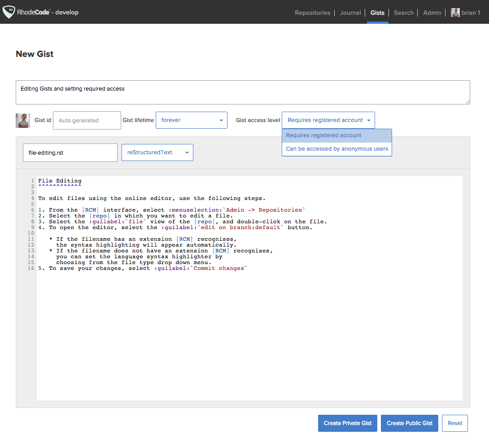

.. _gist-edit:

Gist Editing
^^^^^^^^^^^^

Gists are standalone files that only the creator can edit. To work with
gists, click on the :guilabel:`Gists` tab on the |RCM| header. The gist
editor also has syntax highlighting.

You can set the following properties for each gist:

* :guilabel:`Public`: Public gists are as the name suggests,
  and will show up in searches.
* :guilabel:`Gist Lifetime`: You can set a gist to expire after a set
  period by using the :guilabel:`Gist Lifetime` dropdown menu.
  This means that when the gist expires it will be deleted from the |RCM|
  gist database.
* :guilabel:`Private`: This means that the gist will not show up in searches.
* :guilabel:`Gist access level`: If you create a private gist you can have
  two levels of privacy with the gist link.

  * :guilabel:`Requires registered account`: This option requires users to
    have a registered account on the |RCE| instance, otherwise they will not
    have access to the gist.
  * :guilabel:`Can be accessed by anonymous users`: This option hides the
    link so that it does not show up in searches, but you can still share it
    with people outside of your organisation.

For more advanced use of gists, see the gist API options in the :ref:`api`

